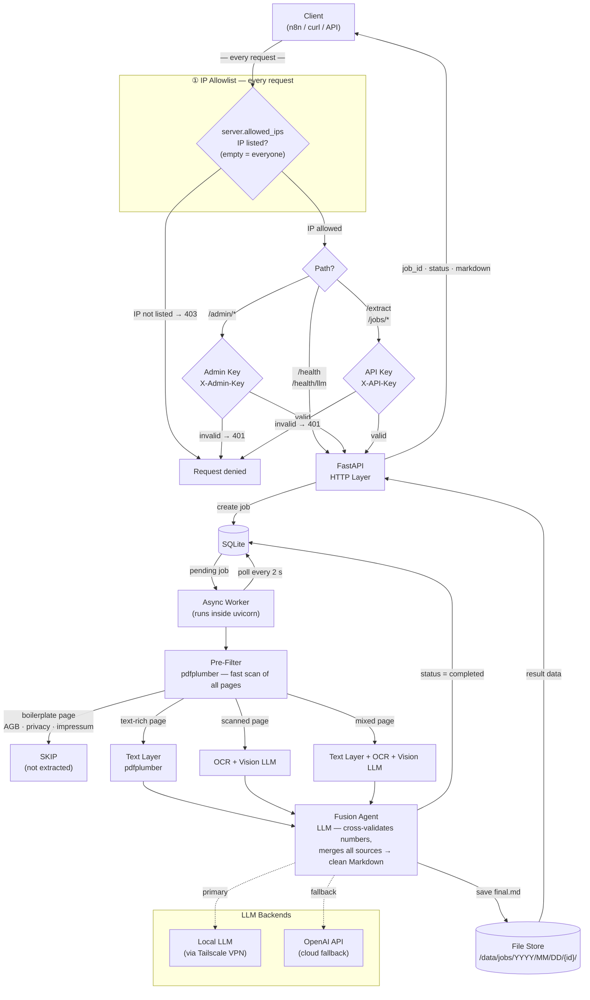

# IDES — Intelligent Document Extraction System

**PDFs shouldn't hold your data hostage.**

Every day, invoices, offers, and contracts arrive as PDFs. The numbers you need are in there — buried in scanned images, multi-column layouts, and 12-page appendices of boilerplate nobody asked for. Copying them by hand doesn't scale. Generic extraction tools guess, hallucinate, or silently drop rows. You end up building validation logic on top of unreliable output, and still fixing mistakes manually.

IDES takes a different approach. It reads PDFs the way a meticulous accountant would — using every available source, cross-checking every number, and skipping the pages that don't matter. The result is clean, structured Markdown you can actually trust.

---

## Why IDES

Most extraction tools pick one strategy: OCR everything, or send every page to a vision model. Both are expensive and error-prone. IDES uses an **adaptive, cheapest-first pipeline**:

- Pages with a clean digital text layer? Read them directly — **free, instant, perfect fidelity.**
- Scanned pages? OCR with Tesseract — **free, fast, no API call.**
- Complex layouts where structure matters? Vision LLM — **only when nothing else is enough.**
- Every number on every page is **cross-validated across all sources** before it's written to output. If pdfplumber, OCR, and the vision model all agree on `€ 12.450,00` — it goes in. If they disagree, the fusion agent picks the most reliable source and uses that.
- Boilerplate (AGB, Impressum, privacy policies) is **detected and skipped** automatically — no LLM tokens wasted on pages you don't need.

The result: high accuracy at a fraction of the cost of "send everything to GPT-4o."

---

## What You Get

- **A production-ready API service** — submit a PDF, get a `job_id`, poll for results. Works out of the box with n8n, Make, Zapier, or any HTTP client.
- **Structured Markdown output** — tables preserved, numbers exact, language unchanged.
- **Per-page breakdown** — see exactly which layers ran, what was skipped, and why.
- **Full management CLI** — create API keys, inspect jobs, check server health, clean up old files — all without touching the database directly.
- **Two-layer IP security** — a global service allowlist in `config.yaml` (blocks everything from unlisted IPs before any key check) plus optional per-key IP restrictions for individual callers.
- **Self-hosted, no lock-in** — runs on any VPS. Use your own local LLM via Tailscale, fall back to OpenAI, or mix both.
- **Configurable everything** — file size limits, page limits, concurrency, timeouts, boilerplate patterns, DPI settings — all in one YAML file.

---

## How It Works



> **Every request passes through the IP allowlist first** — no exceptions.
> After that, `/health` endpoints are public (no key needed), `/admin/*` requires the admin key, and `/extract` + `/jobs/*` require an API key.
> The IP allowlist is opt-in: leave `server.allowed_ips` empty (the default) to allow all IPs, or populate it to restrict the entire service to specific addresses.

---

## Quick Start

### 1. Install

```bash
git clone https://github.com/webboty/IDES.git
cd IDES

python3 -m venv .venv
source .venv/bin/activate
pip install -e ".[dev]"
```

**macOS:**
```bash
brew install tesseract tesseract-lang poppler
```

**Ubuntu / Debian:**
```bash
apt install -y tesseract-ocr tesseract-ocr-deu tesseract-ocr-eng tesseract-ocr-rus \
               poppler-utils libgl1
```

### 2. Configure

```bash
export IDES_ADMIN_KEY="$(python3 -c 'import secrets; print(secrets.token_hex(32))')"
export OPENAI_API_KEY="sk-..."
```

Edit `config.yaml` for your LLM endpoints, storage path, and limits.

### 3. Start

```bash
ides serve
```

### 4. Create an API key

```bash
ides keys create --name my-key --owner me
# Key is printed once — save it.
```

### 5. Extract a PDF

```bash
curl -X POST http://localhost:8000/extract \
  -H "X-API-Key: ides_..." \
  -F "file=@invoice.pdf"
# {"job_id": "abc123...", "status": "pending"}

curl http://localhost:8000/jobs/abc123... \
  -H "X-API-Key: ides_..."
# {"status": "completed", ...}

curl http://localhost:8000/jobs/abc123.../result \
  -H "X-API-Key: ides_..."
# {"markdown": "# Invoice\n\n| Item | ..."}
```

---

## CLI

The `ides` command is installed with the package. See **[CLI.md](CLI.md)** for the full reference.

```
ides serve                     Start the API server
ides status                    Server state, worker, queue depth, disk usage

ides keys create               Create a new API key
ides keys list                 List all active keys
ides keys revoke <id>          Revoke a key immediately

ides jobs list                 List jobs — filter by --date and/or --status
ides jobs stats                Daily statistics for the last N days
ides jobs cancel <id>          Cancel a pending/retrying job
ides jobs purge <id>           Delete job files and DB row permanently
ides jobs cleanup              Delete old job files (keeps DB records)

ides llm [--test]              Show LLM config; --test checks live connectivity
ides restart / stop            Manage the systemd service
```

---

## API Reference

| Endpoint | Method | Auth | Description |
|---|---|---|---|
| `/extract` | POST | API Key | Submit PDF (multipart or base64 JSON) |
| `/jobs/{id}` | GET | API Key | Job status and per-page progress |
| `/jobs/{id}/result` | GET | API Key | Final Markdown + metadata |
| `/jobs/{id}/detail` | GET | API Key | Full per-page breakdown with layer stats |
| `/admin/keys` | POST | Admin Key | Create API key |
| `/admin/keys` | GET | Admin Key | List all API keys |
| `/admin/keys/{id}` | DELETE | Admin Key | Deactivate a key |
| `/health` | GET | None | Liveness check |
| `/health/llm` | GET | None | LLM provider connectivity status |

**Job statuses:** `pending` → `processing` → `completed` / `failed`
On failure: retries as `retrying` (attempt 2), then `recovering` (attempt 3, agent-guided), then `failed`.

---

## n8n Integration

In an n8n **HTTP Request** node:

```
Method:  POST
URL:     https://your-domain.com/extract
Auth:    Header Auth — X-API-Key: ides_...
Body:    Multipart/Form-Data
  file             → binary from previous node
  pages            → "all"
  skip_boilerplate → "true"
```

**Polling workflow:**
1. `POST /extract` → save `job_id`
2. Wait 10 s
3. `GET /jobs/{job_id}` → check `status`
4. Not `completed` yet? Wait 5 s → repeat
5. `GET /jobs/{job_id}/result` → get `markdown`

---

## Documentation

| | |
|---|---|
| [DEPLOY.md](DEPLOY.md) | Step-by-step server setup — Ubuntu, nginx, systemd, Tailscale, Let's Encrypt |
| [CLI.md](CLI.md) | Full CLI reference — every command, flag, and common workflow |
| [ARCHITECTURE.md](ARCHITECTURE.md) | How IDES is built — pipeline design, database schema, security model, scaling path |

---

## Project Structure

```
IDES/
├── ides/
│   ├── main.py              # FastAPI app + embedded async worker
│   ├── cli.py               # Management CLI (ides serve / keys / jobs / status …)
│   ├── config.py            # YAML + env var config (Pydantic Settings)
│   ├── models.py            # Pydantic request/response schemas
│   ├── security.py          # Auth middleware (global IP allowlist + API/admin key)
│   ├── api/
│   │   ├── jobs.py          # POST /extract, GET /jobs/*
│   │   └── admin.py         # POST/GET/DELETE /admin/keys
│   ├── pipeline/
│   │   ├── orchestrator.py  # Retry loop, job lifecycle
│   │   ├── prefilter.py     # Classify all pages (cheap pass)
│   │   └── page_plan.py     # Per-page layer selection
│   ├── extractors/
│   │   ├── text_layer.py    # pdfplumber — text + tables
│   │   ├── ocr.py           # Tesseract with image preprocessing
│   │   ├── vision.py        # Vision LLM — image → Markdown
│   │   └── images.py        # Embedded image extraction + description
│   ├── fusion/
│   │   ├── rules.py         # Programmatic merge rules
│   │   └── llm_merge.py     # LLM fusion agent
│   ├── agent/
│   │   └── brain.py         # FusionAgent + recovery analysis
│   ├── llm/
│   │   ├── client.py        # Async OpenAI-compatible client
│   │   └── prompts.py       # Default prompt templates
│   └── storage/
│       ├── database.py      # SQLite schema + startup migrations
│       ├── job_store.py     # Job + API key CRUD
│       └── file_store.py    # Date-based file layout
├── tests/                   # 122 tests
├── config.yaml
├── pyproject.toml
├── DEPLOY.md
├── CLI.md
└── ARCHITECTURE.md
```

---

## License

MIT
