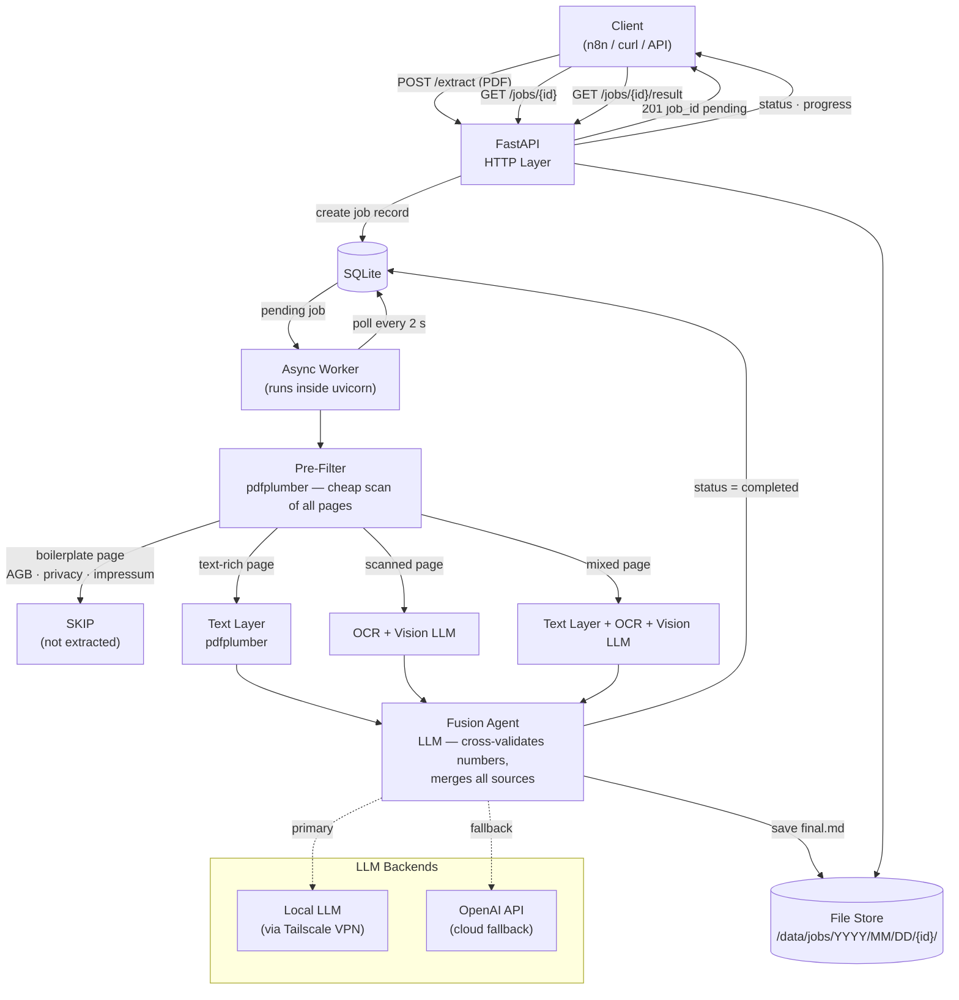

# IDES — Intelligent Document Extraction System

> Async PDF-to-Markdown extraction service with adaptive multi-layer pipeline.
> Built for integration with n8n, automation platforms, and direct API consumption.

---

## Documentation

| Document | Description |
|---|---|
| [DEPLOY.md](DEPLOY.md) | Full server deployment guide (Ubuntu 22.04/24.04, nginx, systemd) |
| [CLI.md](CLI.md) | CLI command reference — manage keys, jobs, and the server |

---

## How It Works

IDES takes a PDF (invoice, offer, contract, any business document) and returns structured Markdown using a **cheapest-first** adaptive pipeline.



**Extraction layers — cheapest first:**

| Layer | Tool | When used |
|---|---|---|
| Text layer | pdfplumber | Digital-text pages (free, instant) |
| OCR | Tesseract | Scanned pages (free, ~1 s/page) |
| Vision LLM | GPT / local model | Image-heavy / mixed pages |
| Fusion agent | LLM | Every non-skipped page — merges + validates numbers |

Boilerplate pages (AGB, Impressum, privacy policy) are detected by regex and optionally confirmed by LLM, then skipped entirely.

---

## Features

- **Async job queue** — submit a PDF, get a `job_id`, poll for results
- **Multi-layer extraction** — text layer, OCR, vision LLM, embedded image descriptions
- **Number cross-validation** — fusion agent compares all sources before emitting any number
- **Boilerplate detection** — regex-first, LLM-confirm, cascade skip
- **Date-based file storage** — `jobs/YYYY/MM/DD/{job_id}/` for easy navigation
- **API key security** — per-user keys with optional IP restriction, SHA-256 stored
- **Configurable limits** — max file size, max pages, concurrency, timeouts, all in `config.yaml`
- **Retry + agent recovery** — up to 3 attempts; on final attempt the agent analyses the failure and adjusts
- **Dual LLM backend** — local model via Tailscale VPN + OpenAI cloud fallback
- **Management CLI** — `ides keys create`, `ides jobs list`, `ides status`, and more (see [CLI.md](CLI.md))

---

## Quick Start

### Prerequisites

- Python 3.11+
- [Tesseract OCR](https://github.com/tesseract-ocr/tesseract) with language packs (`deu`, `eng`, `rus`)
- [Poppler](https://poppler.freedesktop.org/) (`pdf2image` dependency)
- (Optional) Local LLM server ([Ollama](https://ollama.com)) reachable over Tailscale VPN

### Install

```bash
git clone https://github.com/webboty/IDES.git
cd IDES

python3 -m venv .venv
source .venv/bin/activate
pip install -e ".[dev]"
```

**macOS system deps:**
```bash
brew install tesseract tesseract-lang poppler
```

**Ubuntu system deps:**
```bash
apt install -y tesseract-ocr tesseract-ocr-deu tesseract-ocr-eng tesseract-ocr-rus \
               poppler-utils libgl1
```

### Configure

```bash
# Required environment variables
export IDES_ADMIN_KEY="your-secret-admin-key"
export OPENAI_API_KEY="sk-..."     # only if using OpenAI provider
```

Edit `config.yaml` to set your LLM endpoints, storage path, and limits. Key settings:

```yaml
storage:
  base_path: "./data"

extraction:
  max_file_size_mb: 50
  max_pages: 50
```

### Run

```bash
# Development (recommended)
ides serve

# Or directly via uvicorn
uvicorn ides.main:app --host 0.0.0.0 --port 8000 --workers 1
```

> **Important:** always use `--workers 1`. Multiple workers each start their own job polling loop and would process the same jobs twice.

### Create your first API key

```bash
# Via CLI (server does not need to be running)
ides keys create --name my-key --owner me

# Or via the HTTP admin API
curl -X POST http://localhost:8000/admin/keys \
  -H "X-Admin-Key: your-secret-admin-key" \
  -H "Content-Type: application/json" \
  -d '{"name": "my-key", "owner": "me"}'
```

Save the returned key (starts with `ides_`) — it is shown **only once**.

### Extract a PDF

```bash
curl -X POST http://localhost:8000/extract \
  -H "X-API-Key: ides_your-key-here" \
  -F "file=@invoice.pdf" \
  -F "pages=all" \
  -F "skip_boilerplate=true"
# Response: {"job_id": "abc123...", "status": "pending"}

# Poll status
curl http://localhost:8000/jobs/abc123... \
  -H "X-API-Key: ides_your-key-here"

# Get result
curl http://localhost:8000/jobs/abc123.../result \
  -H "X-API-Key: ides_your-key-here"
```

---

## CLI Overview

The `ides` command is installed automatically with the package. See [CLI.md](CLI.md) for the full reference.

```
ides serve                     Start the API server
ides status                    Server state, worker activity, queue depth, disk usage
ides llm [--test]              Show LLM config; --test checks live connectivity

ides keys create               Create a new API key (printed once — save it)
ides keys list                 List all active API keys
ides keys revoke <id>          Revoke an API key

ides jobs list                 List jobs — filter by --date and/or --status
ides jobs stats                Daily job statistics for the last N days
ides jobs cancel <id>          Cancel a pending/retrying job
ides jobs purge <id>           Delete job files and DB row permanently
ides jobs cleanup              Delete old job files (keeps DB records)

ides restart                   Restart the IDES systemd service
ides stop                      Stop the IDES systemd service
```

---

## API Reference

| Endpoint | Method | Auth | Description |
|---|---|---|---|
| `/extract` | POST | API Key | Submit PDF for extraction |
| `/jobs/{id}` | GET | API Key | Job status and progress |
| `/jobs/{id}/result` | GET | API Key | Final Markdown output |
| `/jobs/{id}/detail` | GET | API Key | Full per-page breakdown |
| `/admin/keys` | POST | Admin Key | Create new API key |
| `/admin/keys` | GET | Admin Key | List all API keys |
| `/admin/keys/{id}` | DELETE | Admin Key | Deactivate an API key |
| `/health` | GET | None | Health check |
| `/health/llm` | GET | None | LLM provider status |

**POST /extract** accepts both multipart form-data (file upload) and `application/json` (base64):

```json
{
  "file_base64": "JVBERi0...",
  "filename": "invoice.pdf",
  "pages": "all",
  "skip_boilerplate": true,
  "agent_model": null,
  "agent_provider": null,
  "opencode_skills": []
}
```

**Job statuses:** `pending` → `processing` → `completed` / `failed`
Retries cycle through: `retrying` (attempt 2), `recovering` (attempt 3, agent-guided).

---

## n8n Integration

In an n8n **HTTP Request** node:

```
Method: POST
URL:    https://your-domain.com/extract
Authentication: Header Auth  (Header: X-API-Key, Value: ides_...)
Body:   Multipart/Form-Data
  file               → binary from previous node
  pages              → "all"
  skip_boilerplate   → "true"
```

**Polling workflow:**
1. `POST /extract` → save `job_id`
2. Wait 10 s
3. `GET /jobs/{job_id}` → check `status`
4. If not `completed` → wait 5 s → repeat
5. `GET /jobs/{job_id}/result` → get `markdown`

---

## Project Structure

```
IDES/
├── ides/
│   ├── main.py              # FastAPI app + embedded worker
│   ├── cli.py               # Management CLI (ides serve / keys / jobs / status …)
│   ├── config.py            # YAML + env var config (Pydantic Settings)
│   ├── models.py            # Pydantic request/response schemas
│   ├── security.py          # Auth middleware (API keys + admin key)
│   ├── api/
│   │   ├── jobs.py          # POST /extract, GET /jobs/*
│   │   └── admin.py         # POST/GET/DELETE /admin/keys
│   ├── pipeline/
│   │   ├── orchestrator.py  # Retry loop, job lifecycle
│   │   ├── prefilter.py     # Classify all pages (cheap pass)
│   │   └── page_plan.py     # Per-page layer selection
│   ├── extractors/
│   │   ├── text_layer.py    # pdfplumber: text + tables
│   │   ├── ocr.py           # Tesseract with image preprocessing
│   │   ├── vision.py        # Vision LLM: image → markdown
│   │   └── images.py        # Embedded image extraction + description
│   ├── fusion/
│   │   ├── rules.py         # Programmatic merge rules
│   │   └── llm_merge.py     # LLM fusion agent
│   ├── llm/
│   │   ├── client.py        # Async OpenAI-compatible client
│   │   └── prompts.py       # Default prompt templates
│   └── storage/
│       ├── database.py      # SQLite schema + migrations
│       ├── job_store.py     # Job + API key CRUD
│       └── file_store.py    # Date-based file layout
├── tests/                   # 119 tests
├── config.yaml              # Configuration file
├── pyproject.toml           # Dependencies + entry points
├── DEPLOY.md                # Production deployment guide
└── CLI.md                   # CLI command reference
```

---

## License

MIT
